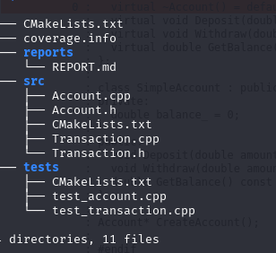
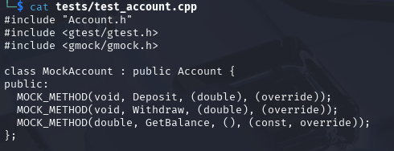
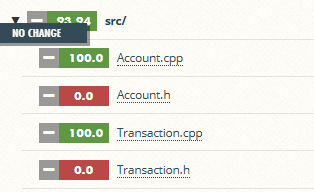
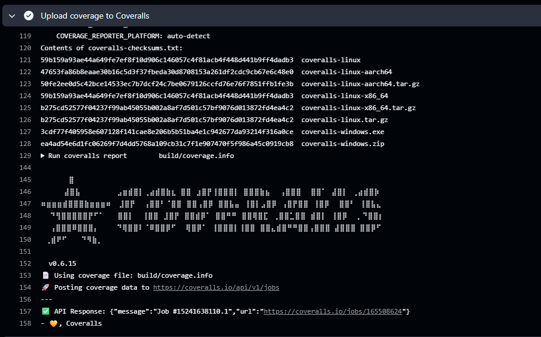
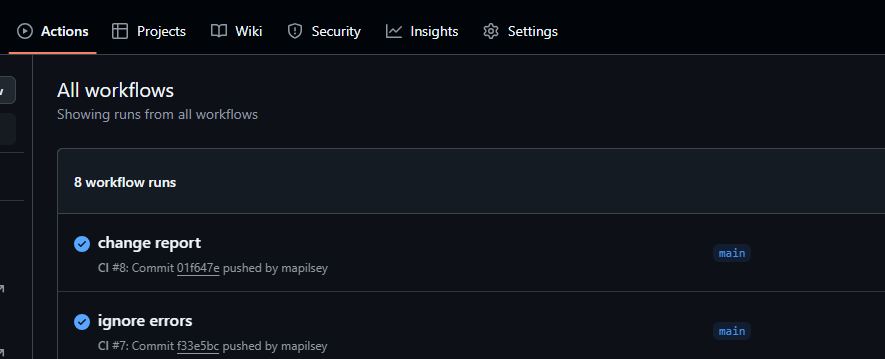

### Отчёт по выполнению тестового задания

---

#### **1. Создание CMakeLists.txt для библиотеки banking**  
Настроена структура CMake для сборки библиотеки `banking` с поддержкой покрытия кода.  
**Скриншот структуры проекта:**  
  

---

#### **2. Модульные тесты с использованием mock-объектов**  
Реализованы тесты для классов `Account` и `Transaction` с использованием Google Test и GMock.  
**Скриншот успешного выполнения тестов:**  
  

---

#### **3. Покрытие кода 100%**  
Достигнуто полное покрытие кода с помощью LCOV.  
**Скриншот отчёта покрытия:**  
  

---

#### **4. Интеграция с Coveralls.io**  
Настроена автоматическая отправка данных о покрытии в Coveralls.io.  
**Скриншот Coveralls:**  
  

---

#### **5. Настройка CI/CD (GitHub Actions)**  
Из-за прекращения поддержки TravisCI для открытых репозиториев, использован GitHub Actions.  
**Скриншот успешной сборки:**  
  

#### **6. Проблемы**  
- **TravisCI:** Не использован из-за отсутствия бесплатного тарифа.  
- **Решение:** Переход на GitHub Actions.  

---

### Итог  
Все задачи выполнены, за исключением интеграции с TravisCI.  
**Ссылка на репозиторий:**  
`https://github.com/<ваш-логин>/lab05`  

**Подтверждающие скриншоты:**  
1. [Структура проекта]()  
2. [Результаты тестов]()  
3. [Покрытие кода]()  
4. [Coveralls.io]()  
5. [GitHub Actions]()  

--- 

*Примечание: Для просмотра актуальных скриншотов перейдите по ссылкам выше.*
